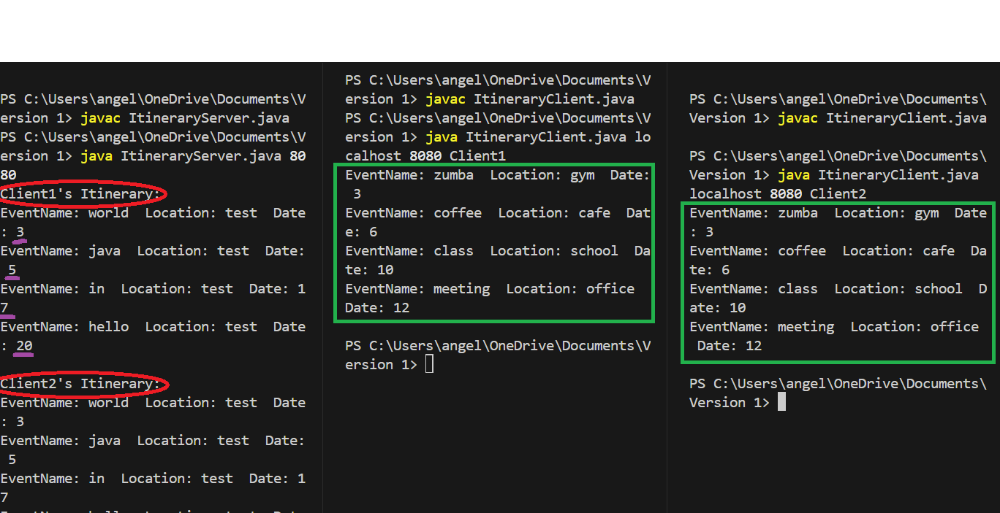
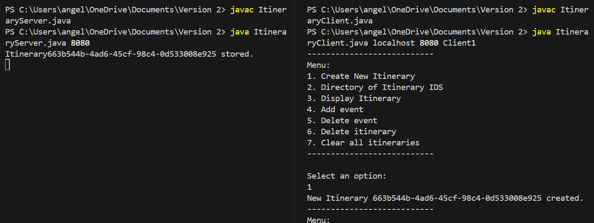
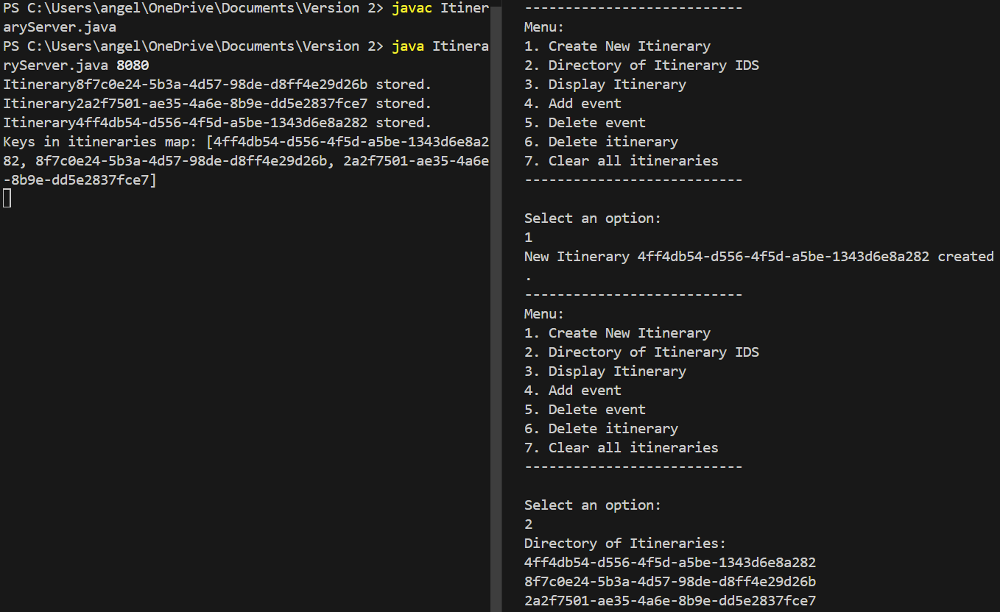
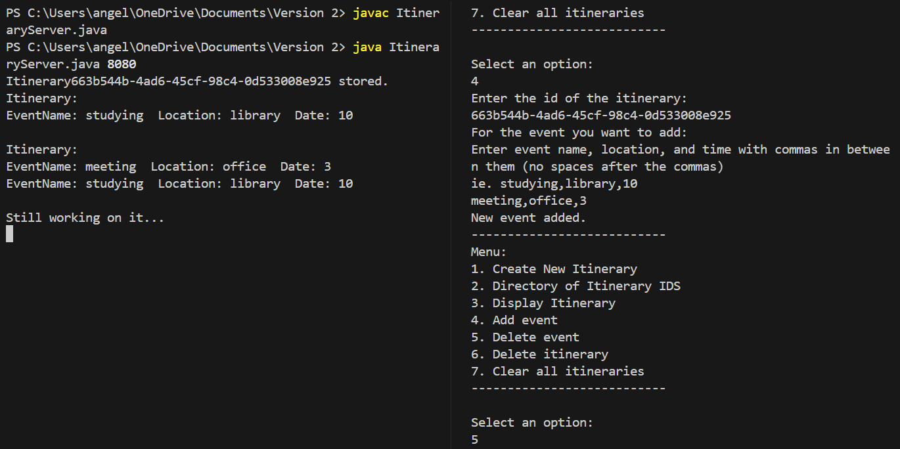
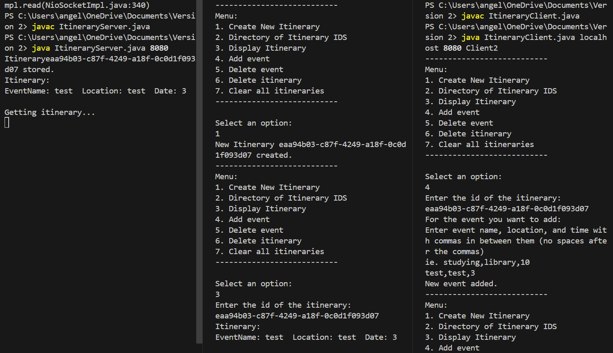

# Itinerary Saver Project
## Overview
Itinerary Saver is a client-server application designed to facilitate communication between multiple clients through a central server. The application allows users to send and collaborate on itineraries in order to plan group trips.

## Status
The current version of Itinerary Saver includes the following features:

1. Demonstrated two-way communication between server and multiple clients
2. Ability to share itinerary as a resource and have concurrent changes being made to it
3. Ability for CRUD operations on the itinerary and the events within the itinerary

## Usage
### Prerequisites
Java Development Kit (JDK) 8 or higher installed on all machines.
Network connectivity between client and server machines.
### Instructions
The client and server programs are supposed to be run in separate devices. Port number should be anything higher than 1024.
```
javac ItineraryServer.java 
java ItineraryServer.java <portNumber>
```
If they are running on the same device but on different terminals, hostName would be 'localhost'. Port number would be the same one that is used by server.

```
javac ItineraryClient.java 
java ItineraryClient.java <hostName> <portNumber> <clientName>
```

# Initial Test Cases
## Scenario 1:
1. Client1 sends a hard-coded itinerary to server.
2. Server receives and displays the itinerary.
## Scenario 2: 
1. Server sends a hard-coded itinerary to client.
2. Client1 receives and displays the itinerary.
## Scenario 3:
1. Client2 sends a hard-coded itinerary to server.
2. Server receives and displays the itinerary.
# Screenshot

The red circles highlight how the server is able to keep track of the multiple clients.
The green box shows the itinerary that the server is sending to both tester clients.
The purple lines are indicating that the itinerary is being sorted by the time attribute.
# Newer Test Cases
## Basic Functionality
1. Create New Itinerary

2. Directory of Itinerary IDS

3. Display Itinerary
4. Add event

5. Delete event
6. Delete itinerary    
5. Delete event  
6. Delete itinerary
7. Clear all itineraries

## Concurrent Access



# Documents
1. [Requirements Doc](/Network%20Application%20Requirements%20(1).pdf)
2. [Design Doc](/HW%202_%20Design%20Document%20(2).pdf)
